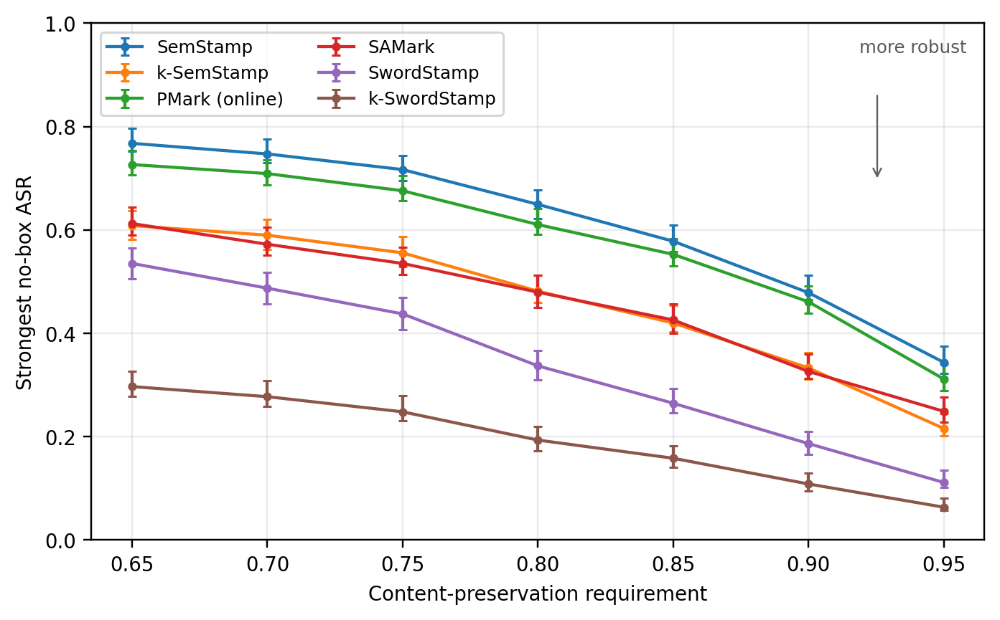
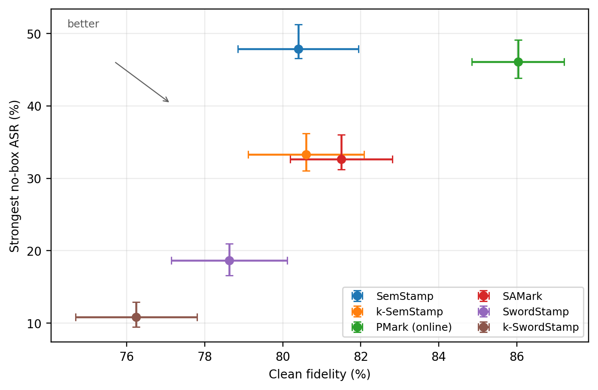
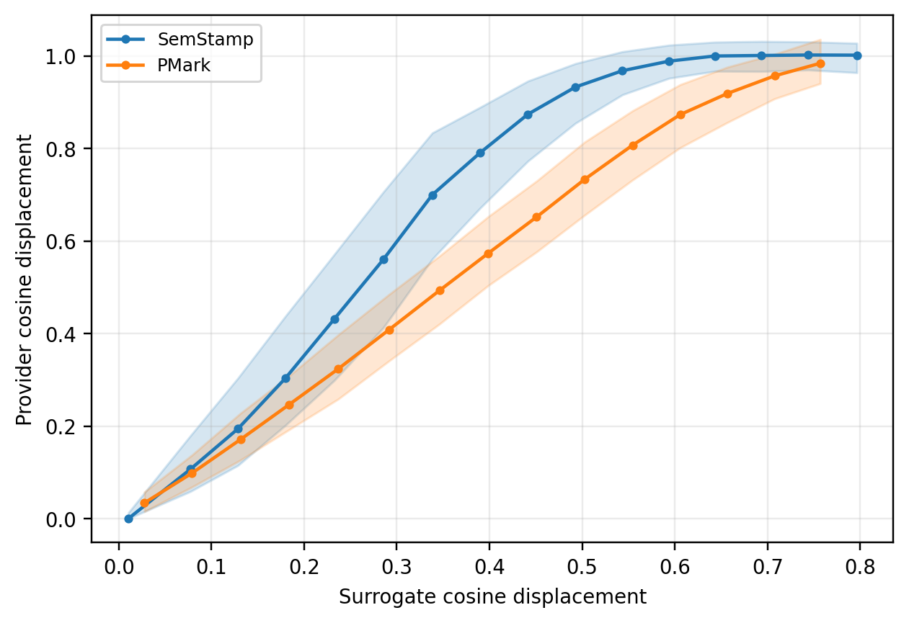

# SwordStamp

SwordStamp adds order-robust detection and semantic-span units to
embedding-based semantic watermarks. This artifact contains the exact paper
configuration, generation and detection code, the unchanged attack suite,
quality evaluation, and deterministic result extraction and plotting.

**Paper:** [Semantic Watermarking with Order-Robust Detection over Sub-sentence
Units](https://arxiv.org/abs/2608.27666) (arXiv:2608.27666)

## Headline results

At 5% false-positive rate and a 90% content-preservation requirement, the
scheme-specific embedding displacement attack (EDA-S) achieves:

| Watermark | EDA-S attack success rate |
| --- | ---: |
| SemStamp | 47.9% |
| k-SemStamp | 33.3% |
| PMark | 46.1% |
| SAMark | 32.6% |
| **SwordStamp** | **18.7%** |
| **k-SwordStamp** | **10.8%** |

Relative to their published baselines, SwordStamp and k-SwordStamp reduce
EDA-S success by 29.2 and 22.5 percentage points, at clean-fidelity costs of
1.8 and 4.4 points. Their clean detection rates are 94.9% and 97.0%. Under the
stronger detector-access EDA-D stress test, maximum quality-gated success is
39.7% on k-SwordStamp versus 65.5% on k-SemStamp.





These results cover English news continuations, one provider model, two
provider encoders, and one EDA paraphraser/surrogate pair.

## Plot a compiled bundle

`visualization` consumes only the compiled CSV/Parquet bundle. It fails on
missing paper cells rather than drawing a partial figure.

```bash
uv sync --frozen --only-group plot --no-install-project
uv run --no-sync python -m visualization extract \
  --bundle results/paper --output results/paper
uv run --no-sync python -m visualization render \
  --bundle results/paper --output results/paper
```

This writes auditable tables under `results/paper/tables/` and seven figures in
PNG and PDF under `results/paper/figures/`. The anonymous review branch includes
the compiled bundle; a full run on the release branch creates the same files
with `python -m visualization compile`.

## Embedding displacement attack (EDA)

The embedding displacement attack (EDA) is an adaptive whole-text paraphrasing
attack. At each output unit it
samples `K` continuations and keeps the candidate with the largest cosine
displacement from its source anchor under a surrogate encoder. Because every
candidate continues the full rewrite prefix, one objective can reword content,
reorder it, and split or merge detector units.

No-box EDA sees the marked text and the public watermark design. It does not
query the detector or generator and receives no secret key, provider encoder,
or quality oracle.

| Variant | Anchor and unit | Configuration |
| --- | --- | --- |
| EDA-P | positional sentence | `adaptive`, `anchor=positional`, attacker unit `sentence` |
| EDA-S | target's public design | positional sentences for SemStamp, k-SemStamp, and PMark; bag/sentence for SAMark; bag/semspan for both SwordStamp variants |
| EDA-D | provider detector | `oracle`; inherits the defender encoder, partition, and segmentation |

For bag anchoring, the paper uses `attack.bag_agg=min`: maximize distance from
the nearest source anchor. Reported no-box runs use
`Qwen/Qwen2.5-3B-Instruct`, `BAAI/bge-base-en-v1.5`,
`K={1,2,4,8,16,32,64}`, temperature 1.0, top-p 0.95, at most 96 tokens per
candidate, and at most 512 rewrite tokens.

Other watermark designers can call EDA directly:

```python
from attacks.paraphrasing.adaptive import adaptive_attack_paraphrase

attacked = adaptive_attack_paraphrase(
    texts,
    base_model="Qwen/Qwen2.5-3B-Instruct",
    surrogate_model="BAAI/bge-base-en-v1.5",
    num_candidates=32,
    anchor="positional",       # EDA-P; use "bag" for an order-robust design
    bag_agg="min",
    segmentation_type="sentence",
    segmentation_backend="nltk",
)
```

For the paper's SwordStamp-aware EDA-S, set `anchor="bag"`,
`segmentation_type="semspan"`, `semcut_max_words=15`, and
`semcut_window=5`. Within this repository the equivalent CLI is:

```bash
uv run python -m attacks DATA_PATH --config PRESET \
  --set attack.paraphraser=adaptive \
  --set attack.custom_model=Qwen/Qwen2.5-3B-Instruct \
  --set attack.surrogate_model=BAAI/bge-base-en-v1.5 \
  --set attack.num_candidates=32 \
  --set attack.anchor=bag --set attack.bag_agg=min \
  --set segmentation.attacker_type=semspan \
  --set segmentation.attacker_backend=nltk
```

`DATA_PATH` is always the base corpus and `PRESET` identifies the watermarked
cell. See `attacks/README.md` for all retained attacks and configuration fields.



## Exact paper matrix

`config/paper.py` is the single source of truth. For each of LSH and k-means,
`scripts/experiments/swordstamp.sh` runs this five-rung additive ladder with 64
provider candidates:

1. context-dependent rejection over sentences;
2. best-of-64 selection;
3. a fixed valid set;
4. diversity-aware ranking; and
5. semantic spans with maximum 15 words and comparison window 5.

The grid contains only these ten cells and one no-watermark baseline. PMark is
online-only; SAMark uses one flag pattern per run. EDA-D budgets are
`K={4,8,16,32,64}`.

The comparison submodules adapt the public
[PMark](https://github.com/PMark-repo/PMark) and
[SAMark](https://github.com/Z1zs/SAMark) evaluation sources only at their
dataset/result boundaries and shared false-positive calibration; the
watermark algorithms are unchanged.

## Complete experiment flow

Prerequisites are Git, [uv](https://docs.astral.sh/uv/), Python 3.11, CUDA for
model runs, access to the pinned model revisions, and scratch storage.

```bash
git clone --recurse-submodules git@github.com:D-Diaa/SwordStamp.git
cd SwordStamp
bash scripts/setup.sh
uv run --frozen python scripts/check_artifact.py
```

1. Prepare the deterministic, disjoint C4 partitions:

   ```bash
   uv run --frozen python scripts/prepare_c4.py --output-dir data
   ```

2. Install and configure the pinned scheduler. The installer prints its
   user-level side effects before changing anything:

   ```bash
   bash scripts/install_gpu_scheduler.sh --print-plan
   bash scripts/install_gpu_scheduler.sh --yes
   gpu-scheduler init --gpus 0,1
   gpu-scheduler start
   ```

3. Preview, then submit every physical shard:

   ```bash
   for shard in c4-val-def-256 c4-val-def-256b c4-val-def-512; do
     BASE="data/$shard" DRY_RUN=1 bash scripts/experiments/swordstamp.sh
     BASE="data/$shard" DRY_RUN=1 bash scripts/experiments/pmark.sh
     BASE="data/$shard" DRY_RUN=1 bash scripts/experiments/samark.sh
   done
   # Remove DRY_RUN=1 after inspecting the exact DAGs.
   ```

4. Compile, extract, and render:

   ```bash
   uv run --frozen python -m visualization all \
     --bundle results/paper --output results/paper
   ```

The scheduler supplies `CUDA_VISIBLE_DEVICES`; do not select GPUs by probing
`nvidia-smi`. Full reproduction is a multi-day GPU workload. `ARTIFACT.md`
lists hardware, model revisions, expected outputs, and the claim-to-command
map. `scripts/experiments/README.md` documents resume and force behavior.

## Layout and license

- `config/`, `segmentation/`, `sampling/`, `watermarking/`: SwordStamp.
- `attacks/`: EDA and the retained attack suite.
- `quality/`: fidelity and content-preservation evaluation.
- `visualization/`: paper-only compilation, tables, and Matplotlib figures.
- `scripts/experiments/`: scheduler-backed exact paper workflows.
- `external/`: pinned PMark and SAMark comparison submodules.

First-party code is released under the MIT License. Models, datasets, generated
text, and comparison submodules retain their own terms; see `THIRD_PARTY.md`.

## Citation

If you use SwordStamp, please cite the paper:

```bibtex
@misc{diaa2026semantic,
  title         = {Semantic Watermarking with Order-Robust Detection over Sub-sentence Units},
  author        = {Abdulrahman Diaa and Jonathan Petit and Florian Kerschbaum},
  year          = {2026},
  eprint        = {2608.27666},
  archivePrefix = {arXiv},
  primaryClass  = {cs.CR},
  url           = {https://arxiv.org/abs/2608.27666},
}
```

SwordStamp software is authored by Abdulrahman Diaa; the paper authors are
Abdulrahman Diaa, Jonathan Petit, and Florian Kerschbaum. Machine-readable
software and preferred paper citation metadata is in `CITATION.cff`.
